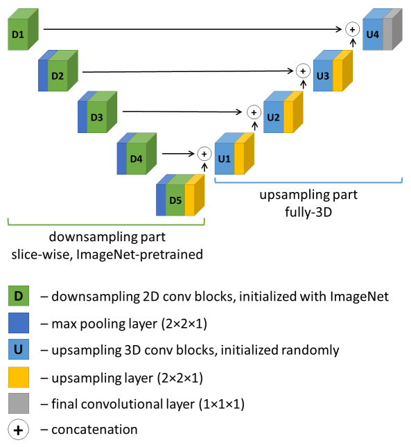
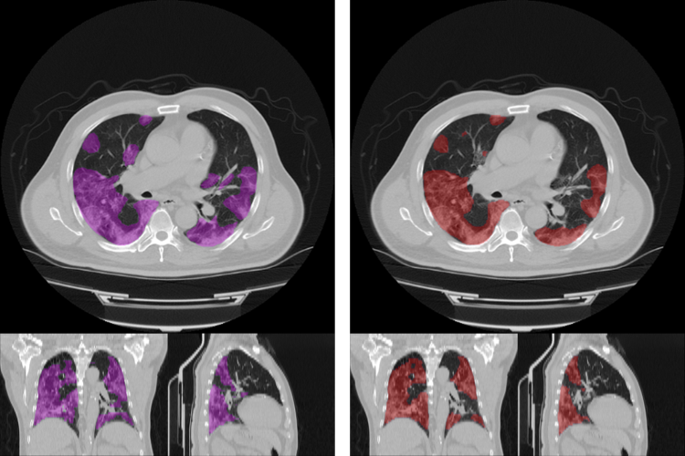

# SRC

The basic scripts and setting files are stored here.
The current framework is based on the open-source [MONAI framework](https://github.com/Project-MONAI/tutorials/tree/master/3d_segmentation/challenge_baseline/)
provided by the challenge organizers.
The key differences from MONAI are in the way of data preprocessing, sampling, augmentation and, most importantly,
the proposed VGG16J segmentation network model which allows using ImageNet-trained weights for part of the network
at the initialization step (see details below).
  

### Structure

* [monai_baseline.py](monai_baseline.py) - the main script used for both training and inferrence
* [vgg16j.py](vgg16j.py) generates Pytorch versions of VGG-bases 3D segmentation nets which use ImageNet pretrain,
VGG16J and VGG19J are implemented here
* [vgg16j_keras.py](vgg16j_keras.py) does the same for Keras 
(not used within this framework, some features might be missing)
* [metadata](metadata) stores two versions (`v1` and `v2`) splitting of challenge `Train` data set into 
domestic `training` and `validation` subsets; `v0` version is the default split from MONAI baseline 
* [.env](.env) is used for setting up environment variables which are used by the [monai_baseline.py](monai_baseline.py)

### VGG16J network model

The key idea of the proposed convolutional neural network (CNN) model for 3D segmentation is to perform slice-wise
extraction of features with use of a 2D general-purpose pretrained CNN, and then to perform the 3D segmentation with 
use of the features extracted on different levels.
Thus, the proposed network consists of two parts:
* the downsampling part which performs slice-wise 2D convolutions 
(pretrained ImageNet-weights can be used here);
* the upsampling part which resembles the second half of the well-known UNet architecture and performs 3D convolutions 
(considers inter-slice connections). 

In the current study, VGG16 was used for the downsampling stage, mainly because it was easy to implement. 
Though, any other 2D network can potentially be used in this manner.
Second half of UNet reminds letter **"J"**, so the final architecture can be referred as VGG16J.

Thus, ImageNet-trained weights can be used for initialization of CNN models for 3D medical image segmentation in order to increase the robustness of the final models.

### Variables in ".env"

The following environment variables are used to control the behaviour of the main script. 

* `mode` - either "train" (for network training) or "infer" (for inference)
* `data_folder` - path to directory with images
* `model_folder` - path to where to store the model checkpoints during training
* `cache_dir` - path to cache dir (not used in this version)
* `prediction_folder` - path to where to put prediction results after inference
* `CUDA_VISIBLE_DEVICES` - not used in this version (suggested to leave 0)
* `model` - network model to use, here either "vgg16j" or "vgg19j"
* `split_version` - version of splitting of challenge `Train` data set into 
domestic `training` and `validation` subsets ("0", "1" or "2")
* `start_weights` - path to a model checkpoint to continue training
* `imn_norm` - if "1", ImageNet mean and STD normalization is applied, otherwise use "0"
* `lr` - base learning rate
* `demo` - if "1", the training is performed on the first 10 cases only (to quickly check that the script works fine), 
otherwise use "0"
* `loss` - loss function to use, can be "dice_ce", "ce" or "dice"; 
WARNING: in case of "dice_ce" the cross-entropy term is multiplied by 10 (see in the code `class DiceCELoss`)

### Training scheme

Every time, the CNN training was performed in two stages. 
During the first stage, the combined `dice + 10 * cross_entropy` loss is minimized.
This stage normally took around 200 epochs to converge. 
The second stage is continued from the checkpoint which maximized average Dice score during the first stage.
During few epochs of the second stage, the pure Dice loss was minimized.
The checkpoint which maximum average Dice score was considered further.

Prior to submitting for the Test phase of the challenge, the two-stage training was performed for the three
splits of the Train data into domestic `training` and `validation` subsets (`v0`, `v1` and `v2`).
Then the Test set was predicted with use of three resultant models. 
To compose the final predictions of the Test data, 
the corresponding three versions of predictions were merged by voting.    

### Other differences from MONAI baseline

* Voxel spacing: 1.25 x 1.25 x 5 mm
* Image sample size: 192 x 192 x 32
* DiceCELoss: cross-entropy term is multiplied by 10 (`dice + 10 * cross_entropy`)
* Image data augmentation
    * probabilities of transforms increased
    * added transforms: AdjustContrast, GaussianSmooth, GaussianSharpen
* [WANDB](https://wandb.ai) logger is used
* When VGG-like model is used without `start_weights`, the pretrained part of the network is frozen for 5 epochs 

### Example result

Below is the example of an original CT image with ground truth segmentation (left) 
and automatic segmentation of lesions (right). 
Dice score > 0.85. 

