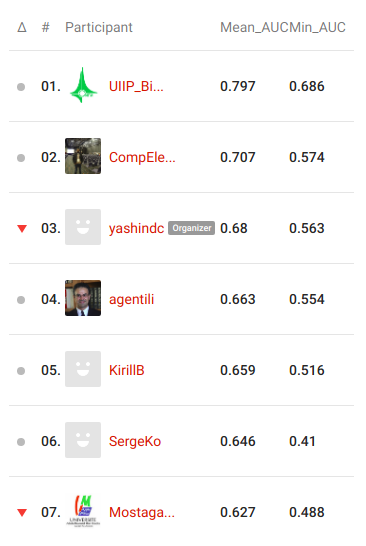

# ImageCLEF2019

The repository contains scripts used upon participation in ImageCLEFtuberculosis 2019 challenge by [UIIP_BioMed](https://www.crowdai.org/participants/uiip_biomed).
The challenge was dedicated to the analysis of 3D Computed Tomography (CT) image data of tuberculosis (TB) patients.

* ImageCLEFtuberculosis page: https://www.imageclef.org/2019/medical/tuberculosis/
* Working Notes published on CEUR-WS.org (PDF): http://ceur-ws.org/Vol-2380/paper_70.pdf
* CT Report generation subtask (CTR): https://www.crowdai.org/challenges/imageclef-2019-tuberculosis-ct-report
* TB Severity scoring subtask (SVR): https://www.crowdai.org/challenges/imageclef-2019-tuberculosis-severity-scoring

### Structure

[Scripts](Scripts/) folder contains the basic Python scripts for data processing and models training.

[data](data/) folder will contain auxiliary data generated by the scripts.

### Running

Prior to running the scripts, the datasets provided by the organizers must be downloaded. 
Along with the lung masks provided by the organizers [1] in this study an additional lung segmentation was used. 
For short description of the additional segmentation method see [2].
The additional lungs masks were obtained via segmentation-through-registration scheme and are available for [download](https://drive.google.com/open?id=1DKPcSQLZ-Ff7Xp2fSnc46O9cqLM24aV3) (130 MB). Source codes imlpementing the segmentation method are [available on Github](https://github.com/skliff13/CT_RegSegm).

### Results

The proposed approaches allowed achieving good results in both 
[CTR](https://www.crowdai.org/challenges/imageclef-2019-tuberculosis-ct-report/leaderboards) and 
[SVR](https://www.crowdai.org/challenges/imageclef-2019-tuberculosis-severity-scoring/leaderboards) 
subtasks of ImageCLEF Tuberculosis 2019 task (see [UIIP_BioMed](https://www.crowdai.org/participants/uiip_biomed)).

_________

### Acknowledgements

This study was partly supported by the National Institute of Allergy and Infectious Diseases, National Institutes of Health, U.S. Department of Health and Human Services, USA through the [CRDF](https://www.crdfglobal.org/) project DAA3-18-64818-1 ”Year 7: Belarus TB Database and TB Portals”. 

### References

[1] Dicente Cid, Y., Jimenez-del-Toro, O., Depeursinge, A., M¨uller, H.: Efficient and
fully automatic segmentation of the lungs in CT volumes. In Orcun Goksel,
Jimenez-del-Toro, O., Foncubierta-Rodriguez, A., M¨uller, H., eds.: Proceedings of
the VISCERAL Challenge at ISBI. Number 1390 in CEUR Workshop Proceedings
(Apr 2015) 31–35

[2] Liauchuk, V., Kovalev, V.: ImageCLEF 2017: Supervoxels and co-occurrence for
tuberculosis CT image classification. In: CLEF2017 Working Notes. CEUR Workshop Proceedings, Dublin, Ireland, CEUR-WS.org <http://ceur-ws.org> (September 11-14 2017) (URL: http://ceur-ws.org/Vol-1866/paper_146.pdf).
